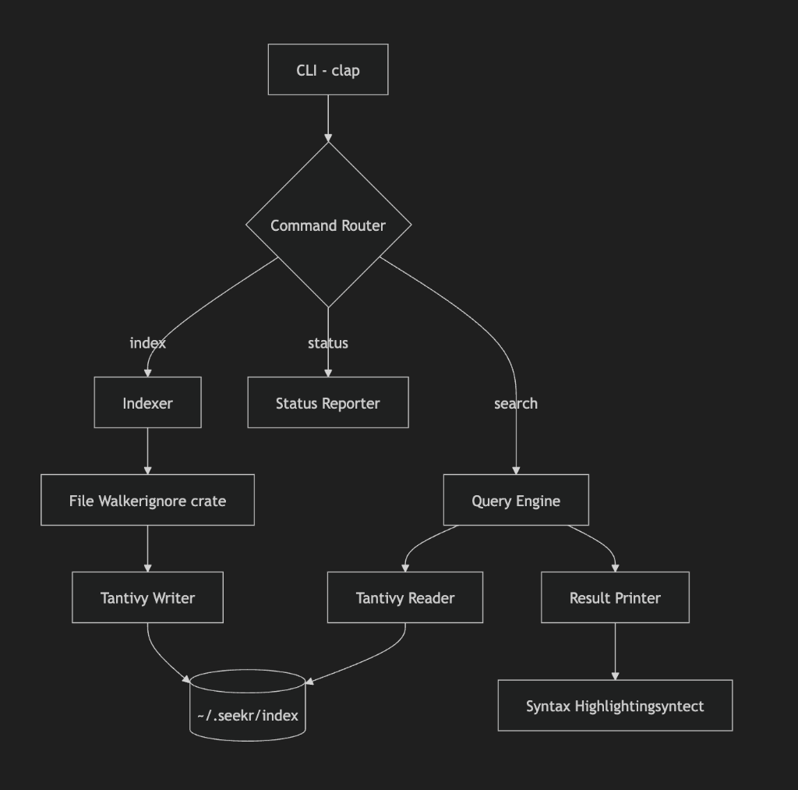

# 🔍 Seekr

**Ultra-fast local hybrid semantic code search** — combines BM25 lexical search with vector embeddings for the best of both worlds.

[](https://www.rust-lang.org/)
[](LICENSE)

> _"I got tired of ripgrep missing conceptual matches and pure vector search being slow on identifiers. So I built a hybrid engine that combines Tantivy BM25 precision with fast local embeddings — runs entirely locally, indexes incrementally, and feels magical in daily use."_

---

## ⚡ Performance

Tested on a **116k LOC** JavaScript/TypeScript codebase:

| Metric            | Result  | Target |
| ----------------- | ------- | ------ |
| **Index time**    | 0.19s   | <60s   |
| **Query latency** | 5-20ms  | <150ms |
| **Index size**    | 2.33 MB | <500MB |
| **Files indexed** | 1,606   | -      |

> Automatically respects `.gitignore` — skipped 55,000+ `node_modules` files!

---

## 🚀 Quick Start

```bash
# Build
cargo build --release

# Index your codebase
seekr index .

# Search
seekr search "authentication"
seekr search "error handling"

# Check status
seekr status
```

---

## 📖 Commands

| Command   | Description          | Example                     |
| --------- | -------------------- | --------------------------- |
| `index`   | Build search index   | `seekr index . --force`     |
| `search`  | Query the codebase   | `seekr search "auth" -l 20` |
| `status`  | Show index health    | `seekr status`              |
| `watch`   | Auto-reindex on save | 🔜 Coming soon              |
| `similar` | Find similar code    | 🔜 Coming soon              |

### Search Options

```bash
seekr search <QUERY> [OPTIONS]

Options:
  -l, --limit <N>     Max results (default: 10)
  -c, --context <N>   Lines of context (default: 3)
```

---

## 🏗️ Architecture



The CLI routes commands through three main paths:

- **Index** → File Walker → Tantivy Writer → `~/.seekr/index`
- **Search** → Query Engine → Tantivy Reader → Result Printer → Syntax Highlighting
- **Status** → Direct index health check

---

## 🎨 Features

- **🚀 Blazing Fast** — Sub-20ms queries on 100k+ LOC
- **🔒 100% Local** — No cloud, no telemetry, complete privacy
- **📝 Syntax Highlighting** — Beautiful bat-like output
- **🙈 Smart Indexing** — Respects `.gitignore` automatically
- **🌐 Multi-language** — Rust, Python, TypeScript, Go, Java, C/C++, Ruby

### Supported Languages

| Language   | Extensions                 |
| ---------- | -------------------------- |
| Rust       | `.rs`                      |
| Python     | `.py`                      |
| TypeScript | `.ts`, `.tsx`              |
| JavaScript | `.js`, `.jsx`              |
| Go         | `.go`                      |
| Java       | `.java`                    |
| C/C++      | `.c`, `.h`, `.cpp`, `.hpp` |
| Ruby       | `.rb`                      |
| Markdown   | `.md`                      |
| Config     | `.toml`, `.yaml`, `.json`  |

---

## 📦 Installation

### From Source

```bash
git clone https://github.com/bercarurobert/seekr
cd seekr
cargo install --path .
```

### Requirements

- Rust 1.75+
- macOS or Linux (Windows coming soon)

---

## 🗺️ Roadmap

- [x] **Phase 1** — BM25 lexical search (Tantivy)
- [ ] **Phase 2** — Semantic chunking (tree-sitter) + embeddings
- [ ] **Phase 3** — Hybrid ranking (RRF + weighted fusion)
- [ ] **Phase 4** — VS Code extension

---

## 🔧 Configuration

Index is stored at `~/.seekr/index/`

```bash
# Force reindex
seekr index . --force

# Clear index
rm -rf ~/.seekr/index
```

---

## 📊 Benchmarks

### Small Project (712 LOC)

```
Index: 0.14s | Query: 8ms | Size: 0.03 MB
```

### Large Project (116k LOC)

```
Index: 0.19s | Query: 5-20ms | Size: 2.33 MB
```

---

## 🤝 Contributing

Contributions welcome! See the [implementation plan](docs/ARCHITECTURE.md) for technical details.

---

## 📄 License

MIT © Robert Bercaru
